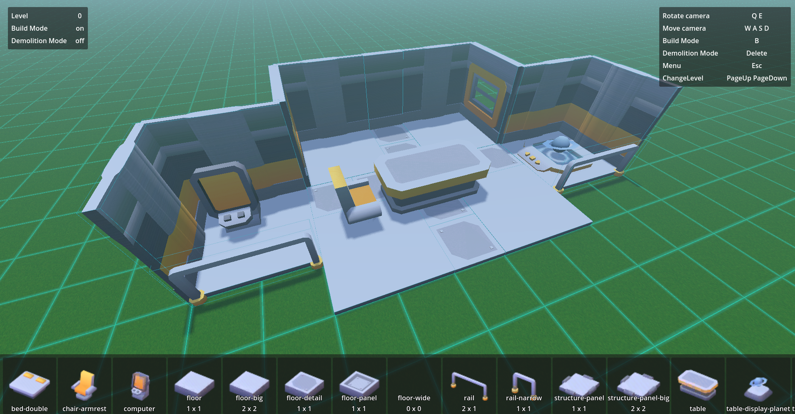
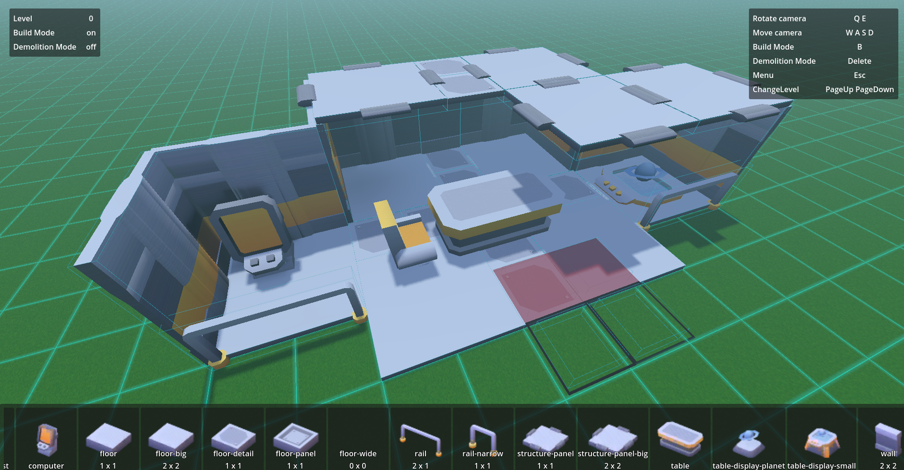
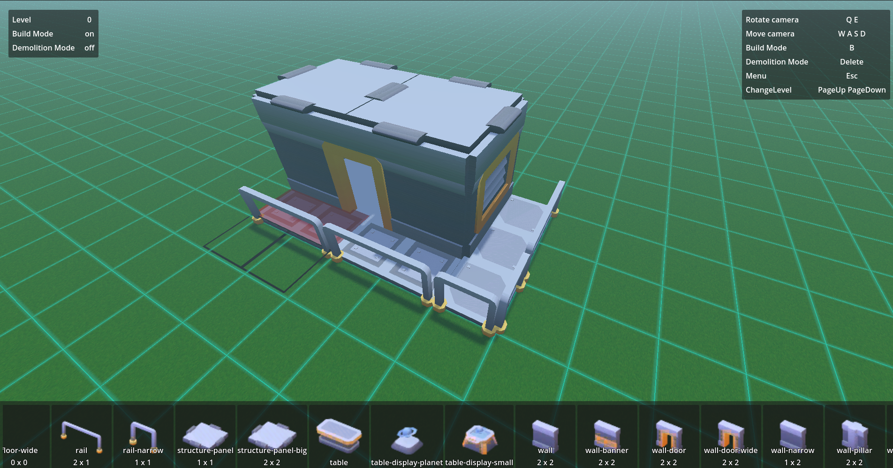
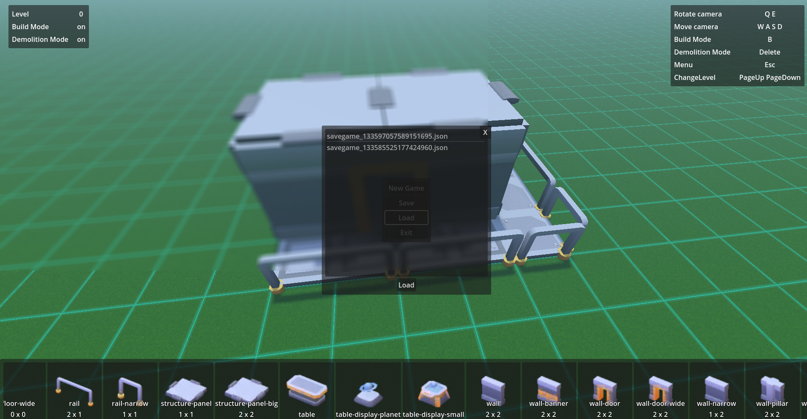
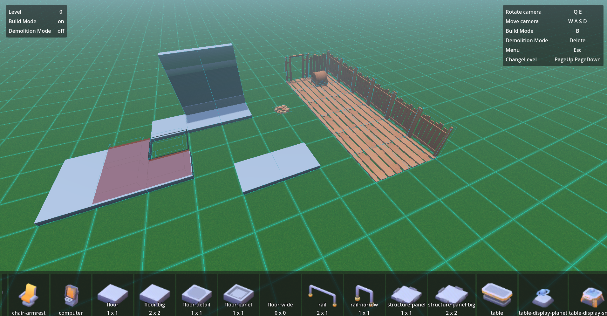

# In Game Building System for Godot

Supporting this project helps me continue to work on it and improve it. If you find it useful, consider contributing through the following methods:

Please consider donating if you think this project has helped you or that it has potential.

## Description

Welcome to the Godot In Game Building System! This project is a comprehensive starter kit designed for creating building simulation games(or just games with building mechanic) in Godot 4. It includes both grid-based and free-form building features, making it versatile for different types of building gameplay. The system is equipped with a save/load functionality, basic UI for menus and building controls, and is ready to be expanded or customized for your own unique game.

## Features

- **Grid Building**: Place structures in a fixed grid format, perfect for strategy and simulation game styles.
- **Free Building**: Freely place and rotate structures for more creative and aesthetic building setups.
- **Save/Load System**: Save your progress and load previous states with a robust save/load system. The save system can be used to save and load any type of data. It uses JSON as the default file extension for saving data and supports encryption to prevent tampering with save data outside the game.
- **Basic UI**: A simple and intuitive user interface that allows easy access to building options and game menus.
- **Event Bus**: The system uses an event bus for communication between different parts of the system.
- **Extensible Architecture**: Designed with scalability in mind, allowing for easy additions and modifications.
- **Documentation** - Auto-generated documentation from comments

## Getting Started

To get started with Building System:

1. Clone this repository:
   git clone https://github.com/yourusername/godot-house-building-system.git
2. Open Godot 4 and import the project.
3. Open the demo_scene.tscn from BuildingSystem folder
4. Run the project to see it in action and start building!

### Basic Concept

- BuildingSystem contains multiple BuildingSystemGrids.
- BuildingSystemGrid contains GridCells.
- GridCell is a container for BuildableInstances.
- BuildableInstance represents an object that is placed on the grid.
  - Consider BuildableInstance as an instance of BuildableResource with extended functionality.
- BuildableResource represents models.
  - It is intended to separate visual representation and code, allowing us to easily switch models without affecting the system.
  - It also allows you to add custom scripts to imported visuals.

### Adding New Objects:

1. Import the asset.
2. Create a BuildableResource.
3. Set the asset as the Object3DModel and configure other properties.
4. Add it to an existing or new BuildableResourceLibrary.
5. Assign the library to the BuildingSystem.

> The BuildingSystem considers objects to have a pivot point at the center.

> The best approach to importing assets is to create a scene for each imported model and create a Node3D parent. This way, you can easily position the object, adjust the scale, etc., without affecting the system.

> **Bonus!** There is an import script `import_objects.gd` that will do just that and also create a resource for it.

For more detailed information about the classes and methods in the system, refer to the GodotInGameBuildingSystem.xml documentation file.

## Contributing

Contributions are what make the open-source community such a fantastic place to learn, inspire, and create. Any contributions you make are **greatly appreciated**.

To debug the project use included `.vscode` config files, set `GODOT4` environment varable to point to godot.exe or just add its path to `launch.json`.

To contribute to code:

1. Fork the Project
2. Create your Feature Branch (`git checkout -b feature/AmazingFeature`)
3. Commit your Changes (`git commit -m 'Add some AmazingFeature'`)
4. Push to the Branch (`git push origin feature/AmazingFeature`)
5. Open a Pull Request

**Don't be afraid!** Contribution is not only code, but documentation, tutorials, issue discovery and anything useful.

## License

Distributed under the MIT License. See `LICENSE` for more information.

## Support

If you have any questions or run into issues, please open an issue on this repository and I will try to address it as soon as possible.

For full transparency, this is a hobby project, I will try to give it as much attention as I can, but I have a full-time job and a full house, so please be patient if I do not respond immediately.

## Author

**Marko Dmitrovic** - [MarkoDM](https://github.com/MarkoDM)

## Acknowledgements

- Many thanks to [kenney](https://kenney.nl/) as some assets are used for showcase in the demo
